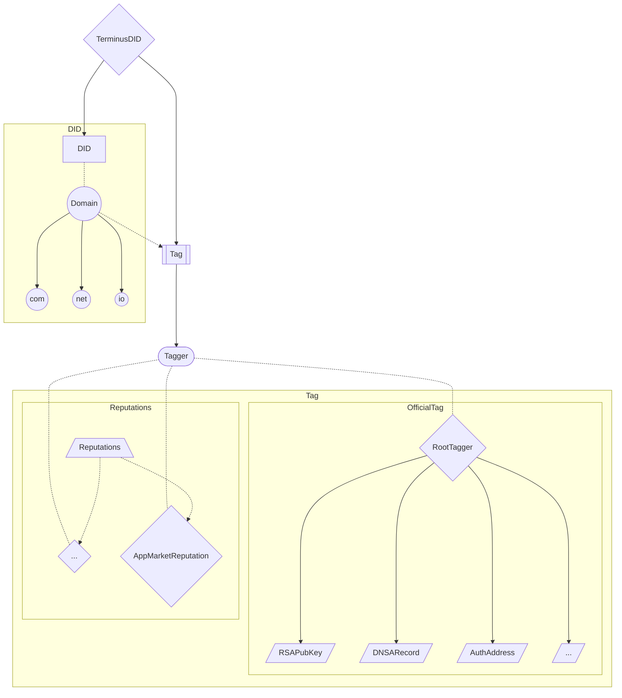

# TerminusDID Contract System

## 架构

本系统整体分为两大部分, DID 管理和 Tag管理, 其中 Tag 管理部分除了本身的架构实现外, 还扩展出了官方 Tag 字段管理和 Reputation 系统两块具体的业务实现, 
DID 和 Tag 的管理/操作方法可以参考[这里](./contract-manager.md), TerminusDID 合约的详细设计可以看[这里](./contract-tdid.md), Reputation 系统的推荐实现和例子可以看[这里](./contract-reputation.md)

## 设计细节

### multicall
考虑到合约本身的复杂度和使用场景的不确定性, 为了尽量简化链下与链上的交互, 我们在合约中内置了 multicall 功能, 您可以在一次调用中访问多个接口而不需借助外部的 multicall 合约

### EIP7201
我们的合约在数据存储上遵循了 EIP7201, 这使得合约的升级更为安全简单, 同时也让我们实现了对数据的精细化操作

### name 的合法性校验
注册时, name 字段本身是以 string 类型提交的, 虽然以 “.” 进行层级分割, 保证了层级结构的正确性, 但是仅仅做到这一点无法确保 name 本身的正确性和可读性, 所以我们在合约中对 name 进行了编码校验, name 必须是以 UTF8 编码, 或者 Unicode(based on Unicode 15.0.0) 中读部分进行提交

### Tag 内部变量名
为了有效的使用 gas, Tag 中如果出现结构体, 那么结构体内部的变量名将以 event 形式公示在链上, 但是不进行存储, Tag 中会记录定义时的区块高度, 需要获取变量名时提供此 Tag 的定义高度, 合约地址, event 名, 给 evm 的布隆过滤器将可以精确获取到这一条公示变量名的 event

### 内敛汇编
解析/遍历 name 层级时, 我们使用了汇编实现的slice, 这个方法可以有效的避免子串复制，同时还将降低 gas 消耗

## 附录 - 需求

### DID

    在 DID 方面,我们有以下需求

- 在链上实现[DID](https://www.w3.org/TR/did-core/)的管理(优先选择 EVM 类型的链)
- DID 记录中有诸如 ipv4/ipv6, avatar, RSA 公钥 等信息, 并且可以修改
- 对于未来可能出现的新需求, 可以一定程度上扩展记录中的信息

### Terminus Name

    在 Terminus Name 方面,我们有以下需求

- Terminus Name 需要区分 Organization 和 Individual 两种不同类型的 DID
- Organization 有权限对下级派生的所有 DID 进行管理

### Reputation

    在 Reputation 方面,我们有以下需求

- 需要一种 Entity 类型的 DID, 用来在链上映射现实中的事物 - 在 app market reputation 中, 是某个 app 的某个版本 - 在 otmoic reputation 在, 是对某笔交易的投诉
  :::tip Tips
  我们期望可以在 DID 合约的基础上, 设计一套去中心化的信用系统, 在最开始的设计中, 我们想要做一个通用的, 可以适配各种场景的系统, 但随着方案的逐步实施我们发现这样一个大而全的系统带来了很多不必要的资源消耗, 同时也降低了不同场景下的灵活性, 所以我们改变了方向, Reputation 系统提供抽象且必要的功能组件, 以及一些推荐方案, 而具体场景下的实现由使用者自行拼装和定制
  :::

## FAQ
