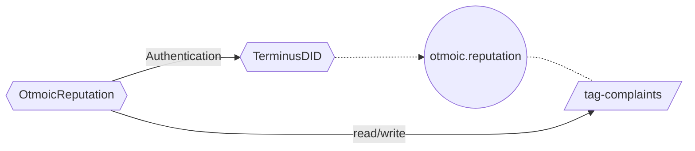
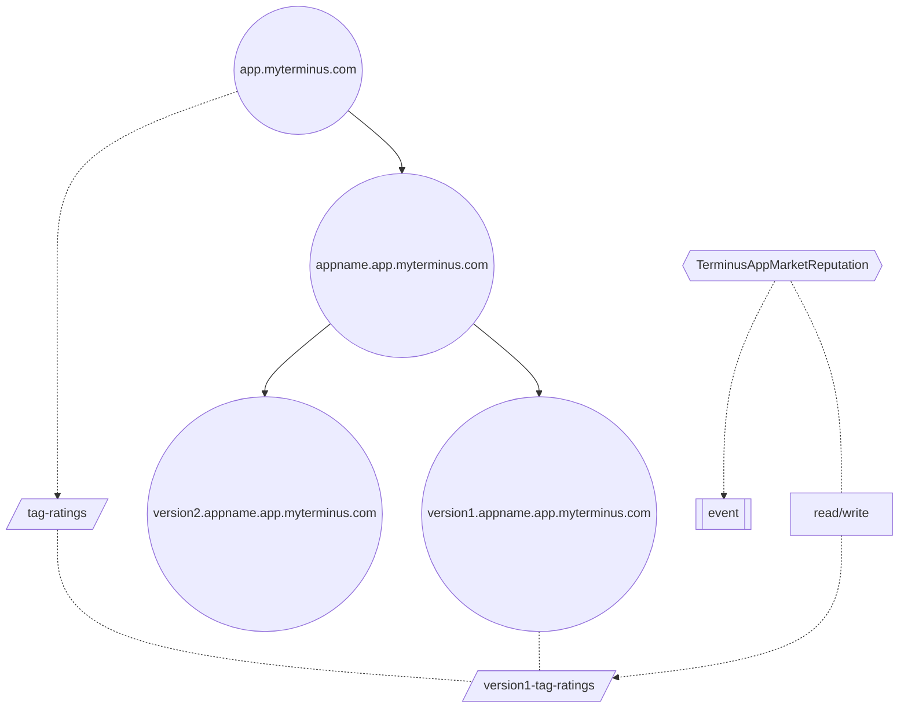

# Reputation

#### 扩展需求 - 抽象的 Reputation 系统

:::info 必要的功能

- 对于现实事务的映射
  所有的信用系统都是建立在某个特定的场景下的, 比如对某个应用的评价, 对某个商家的投诉, 这就不可避免的需要对一些现实事物或者抽象事物在链上建立唯一的标识

- 身份认证
  信用系统中最核心的功能就是评价, 而提交评价前置条件是需要在链上对评价者进行身份认证

- 必要信息的存储
  在评价过后, 我们可能需要对评价的内容进行记录, 或者对被评价物的某些数据进行加权

- 记录历史和修改
  在一些情况下, 我们可能会需要对评价这个行为本身留下记录, 并且可能在未来的某个时间会需要对这条已存在的评价进行修改
  :::

本章节将针对抽象 Reputation 系统的各个需求点依次给出解决方案

## 评价对象

对于评价对象, 可能会出现以下两种情况

- 评价对象是一个商家或个人
  针对这种情况, 评价对象一定拥有 Individual 类型的 DID , 那么系统本身则不需要再创建其他的 DID, 直接针对评价对象进行操作即可
- 评价对象是一个现实事物或抽象概念
  这种情况下我们需要先为评价对象创建 Entity 类型的 DID , 然后再对此 Entity 进行操作

## 身份认证

身份认证方面有两种方案

- 直接使用 DID 的 owner 进行操作, Tagger 中使用 DID 合约 提供的验证方法进行身份验证
- 使用 DID 的 owner 对操作进行 EIP712 规范的签名, 并由代发服务上链, Tagger 中先进行 EIP712 签名的验证, 再使用验证获得的签名地址进行身份验证

> [!NOTE] Tips
> 我们更推荐使用第二种, 此方案的 gas 费由代发服务承担, 所以评价者不需要花时间自行准备 gas

## 必要信息的存储

针对有 Entity DID 的情况, 我们可以直接在 DID 上定义 Tag, 并将需要存储的数据写入, 针对评价对象是 Individual DID 的情况, 我们可以将场景本身抽象为一个 Entity DID, 然后在此 Entity 内存入数据

## 记录历史和修改

此条内容可以遵循上一条的建议, 存储在 Entity 的 Tag 里, 当然, 有些场景是没有实时链上查询的需求的, 针对这种情况, 链上的存储是不必要的消耗, 我们建议仅使用 event 进行处理, 相关逻辑完全由 Tagger 自行实现

## 案例 - OtmoicReputation

:::info

Otmoic 的 Reputation 合约使用了 DID owner 进行 EIP712 签名的方式进行身份验证, 然后将被投诉的 bidid 存储在 otmoic.reputation 这个 Entity 的 complaints 中
:::

## 案例 - TerminusAppMarketReputation

:::info

TerminusAppMarketReputation 合约同样使用了 DID owner 进行 EIP712 签名的方式进行身份验证, 合约中关于评分的数据会被存储在 `<version>.<appname>.app.myterminus.com` 这个对应 Entity 的 ratings 这个 Tag 中, 而评论的部分完全由合约自行处理不做存储, 全部以 event 形式公布在链上
:::
