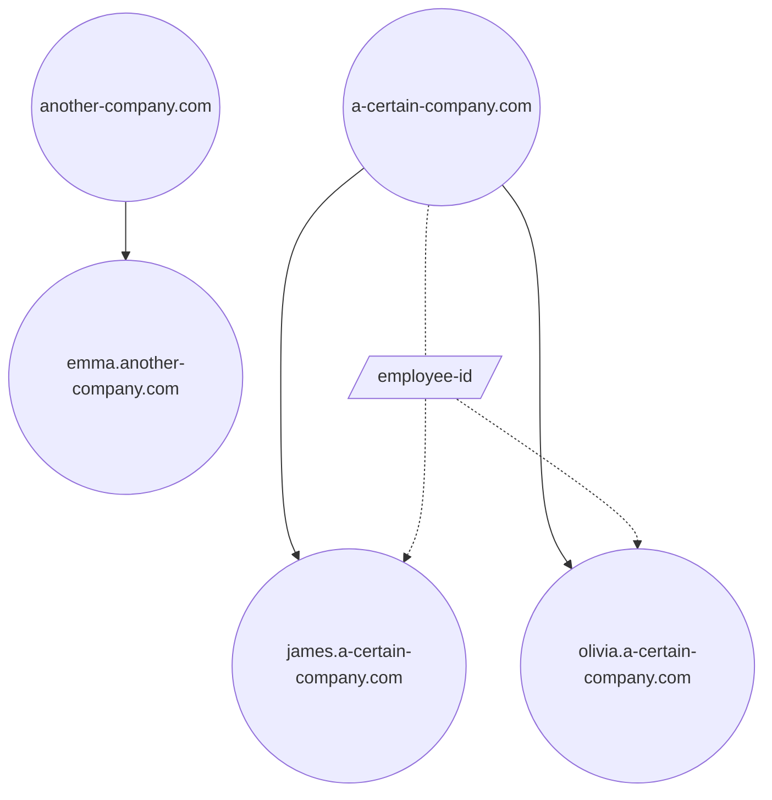

# Contract TermiunsDID
TermiunsDID 合约的管理方法请参考[这里](./contract-manager.md)


## 方案

此章节介绍了 TermiunsDID 合约本身的设计方案, 我们按照 TermiunsDID Contract System 的整体设计蓝图, 进一步细化了核心合约的设计


### 关于 DID

#### DID 中包含哪些信息

##### name

DID 的唯一标识
:::info Terminus Name 命名规则
- 非空的 UTF-8 字符串
- 符合 Unicode(based on Unicode 15.0.0)码位分类的 L, M, N, P, S，但不包括
  - Full Stop (U+002E)
  - Mongolian Free Variation Selectors (U+180B..U+180D)
  - Variation Selectors (U+FE00..U+FE0F)
  - Replacement Characters (U+FFFC..U+FFFD)
  - Variation Selectors Supplement (U+E0100..U+E01EF)
    举例
- 大小写敏感，即 MAX.com 和 max.com 为两个不同的 Terminus Name
- 支持各种文字，包括中文，比如博物馆.中国。
  Ref: https://www.compart.com/en/unicode/category
:::

##### id

每一个 DID 同时也是一个 NFT, 遵循 **ERC-721** 规范实现, id 就是这个 NFT 的唯一标识, 由 `keccak256(name)` 计算得到

did
由助记词推导出来, 在依赖 DID 的系统里, 用于验证持有者身份

##### owner

同样由助记词推导出来, 遵循 **BIP44** 规范, 同样用于验证持有者身份, 作用范围主要在链上合约中

##### note

DID 记录的类型, 目前有以下类型

- Individual
- Organization
- Entity

#### Tag 系统

在基本数据以外, 我们还期望在 DID 中可以维护一些状态或者信息数据, 所以就有了 Tag 系统

##### 如何使用

1. 定义 Tag
2. 向 Tag 写入数据

> [!NOTE]
> tag 的定义和结构是很复杂的,此处不做详细介绍,如果您感兴趣可以移步 合约技术细节
> 这里简单介绍一下 tag 定义中包含的信息
>
> - name : 这个 tag 的名字
> - did: 定义这个 tag 的 did
> - abiType: 这个 tag 的数据类型, 此处遵循 **abi** 的编码规范, 同时也支持定义一个极为复杂的结构
> - fieldNames: 在定义复杂结构时, 内部子结构的名字或者数据的名字以二维数组的形式平铺展开

##### Tag 的作用范围

所有的 Tag 都只能对定义此 tag 的 did 本身, 以及其子域生效
比如 a-certain-company.com 定义了 "employee-id" 这个 tag
则 james.a-certain-company.com 可以直接将自己的 employee-id 设置 001
而没有定义过 employee-id 的 another-company.com 和 emma.another-company.com 则不能设置 employee-id 的值



##### Tag 中的 Tagger

Tagger 是每个 Tag 内的必要信息之一, 不同于定义中的信息, Tagger 可能会经常变动.
Tagger 代表着唯一有权限修改 Tag 值的人或程序, 可以是一个钱包地址, 也可以是一个合约

> [!NOTE]
> 我们推荐您使用合约作为 Tagger
>
> - 参考官方的几个 Tagger 实现, 您可以利用 DID 合约进行完善的操作者身份认证, 同时也可以做到更细致的自定义权限控制
> - 对于复杂的 Tag 结构, 或者有特殊规范的数据内容, 将 Tagger 设定为合约将可以在链上验证数据的格式, 或者制定更完善的自定义规则, 比如官方 Tag 中 RSAPubKey 这个值的读写, 我们在链上对 bytes 数据进行了 Pkcs8 ASN.1 格式的验证, 防止了误设无法解析的值

#### 由谁来创建

考虑到并不是所有人都有链上操作需要的 Gas, 并且在有 Gas 的情况下还需要使用已有 DID 的 owner 地址进行合约操作等问题
我们决定由官方代为执行创建, 当然, 如果您愿意, 也可以使用已有 DID 自行操作合约创建子级

#### 每个 DID 所拥有的权限

DID 拥有对自身以及子域的所有管理权限, 对于直接使用如 `a.b.c` 这样的三级域名注册的 Organization, 如果系统中没有注册过 `b.c` 则 `b.c` 的 owner 将被设定为 `0x0...00d1d` , 并由官方代为管理

#### 流程，概念介绍

TName 的扩展信息是由 TerminusDID 合约的 Tag 系统完成的。在 Tag 系统中，每一个 TName 的 Tag 不仅仅是有 Tag 名字，而且还有 Tag 类型。目前支持的 Tag 类型有 int，uint，bool，string，address，bytes，bytesN 以及 array，arrayN，tuple。如果类型是 tuple，还支持字段名。
Tag 是附着在 TName 上，所以设置 Tag 的步骤为

- 在某个 TName 上定义 Tag，包括 Tag 附着的 TName，Tag 的名字，类型，如果是 tuple 型，还包括了字段名称。关于字段名字的设置是个难点，具体可参考文档 DIDv2.3Tag 类型注册流程介绍的第二节。

代码示例

```Solidity
function defineTag(
    string calldata domain,
    string calldata name,
    bytes calldata abiType,
    string[][] calldata fieldNames
) public
```

- 指定 Tagger，设置此种 Tag 的权限被让渡给了 Tagger。即只有 Tagger 可以设置此类 Tag。Tagger 可以为 EOA 地址，也可以为合约地址，如果是合约地址的话，可以在此合约上实现复杂的 Validation 逻辑。

代码示例

```Solidity
function setTagger(string calldata domain, string calldata name, address tagger) public
```

- 接下来就可以对这个 TName 和 TName 的后代做这种 Tag 的增删查改操作了，

```Solidity
function addTag(string calldata from, string calldata to, string calldata name, bytes calldata value) public
function removeTag(string calldata from, string calldata to, string calldata name) public
function getTagElem(string calldata from, string calldata to, string calldata name, uint256[] calldata elemPath)
    public
    view
returns (bytes memory)
function updateTagElem(
    string calldata from,
    string calldata to,
    string calldata name,
    uint256[] calldata elemPath,
    bytes calldata value
) public
function getTagElemLength(
    string calldata from,
    string calldata to,
    string calldata name,
    uint256[] calldata elemPath
) public view returns (uint256)
function pushTagElem(
    string calldata from,
    string calldata to,
    string calldata name,
    uint256[] calldata elemPath,
    bytes calldata value
) public
function popTagElem(string calldata from, string calldata to, string calldata name, uint256[] calldata elemPath) public
```

其中

- from 为定义 Tag 的 TName
- to 为设置 Tag 的 TName
- name 为 Tag 的名字
- value 为根据类型进行 abi.encode 之后的 bytes 值
- elemPath 是提供给复杂类型的，特别是 array，tuple 类型，使得每一个元素可以单独获取，修改。如果 Tag 类型为简单类型，这个参数为空数组。elemPath 的值类似多维数组的下标（这里把 tuple 也看成数组），在 elemPath[0]的值为第一层的 index，而 elemPath[1]为第二层的 index，elemPath[i]为第 i 层的 index。比如类型 Student 为嵌套了 4 层的 tuple 类型，想直接访问/修改 Student s->Class class->Teacher[1] teachers->People info->string name，则 elemPath 的值应为[1, 2, 1, 0, 0]。虽然只有 4 层嵌套，但是这里有 5 个元素是因为数组类型的存在，多了一层嵌套，例子中获取了 index 为 1 的 teacher 信息。

```Solidity
struct Student {
    People info;
    Class class;
}

struct Class {
    uint8 grade;
    uint8 classNum;
    Teacher[] teachers;
}

struct People {
    string name;
    uint8 age;
    string gender;
}

struct Teacher {
    People info;
    string subject;
}
Student s;
```

- 目前 TerminusDID 合约还提供一批特殊的 Tag，即官方 Tag。它是定义在空字符串这个特殊的 TName 上。官方 Tag 的 Tagger 被指定为 RootTagger。官方 Tag 可以允许所有 TName 添加，具体权限后面介绍 RootTagger 时再介绍。

#### Tag 相关权限控制

1. 在 TName 上定义 Tag，即设置 Tag 名字，类型

- 官方 Tag：operator 拥有权限
- 其他 Tag：TName 的 owner 拥有权限
  下列情况会定义 Tag 失败：
- TName 上某个 Tag 名字只能定义一次，不能重复定义
- Tag 名字和 tuple 的字段名必须符合这个标准：以 a~z 开头，只能包括 a~z, A~Z, 0~9
- Tag 类型编译后的 bytes 长度不能超过 31
- Tag 类型必须符合 ABI 库中定义的类型要求
- tuple 中的 fieldNames 赋值必须跟 tuple 类型定义相符
- tuple 中属性名字在同一节点下不能重复

2. 设置 Tagger

- 官方 Tag：operator 拥有权限
- 其他 Tag：TName 的 owner 拥有权限

3. 设置 Tag
   具体 Tag 设置的权限控制让渡给了 Tagger。后面介绍几个官方 Tagger 的具体情况。


### 注册规则以及权限控制

从合约层面来看，目前只有 operator 可以注册顶级 TName。通过合约接口 register 注册。注册的时候需要指定 TName 的 owner，和元信息。元信息指定后无法修改。后代 TName 可由 operator 或其祖先 TName 的 owner 注册完成。
即注册只能由下列角色完成：

- 合约的 operator 地址
- 父 TName 的 owner 地址：可注册其后代 TName。
  以下情况不能注册：
- 如果 TName 不是顶级的情况下：父 TName 不存在，或者父 TName 的元属性中设置了不允许子域名
- TName 中的子字符串为非法字符串
- TName 已被注册的情况
- TName 的指定 owner 为 0 地址

源码示例

```Solidity
struct Metadata {
string domain;
string did;
string notes;
bool allowSubdomain;
}

function register(address tokenOwner, Metadata calldata metadata) public returns (uint256 tokenId)
```

注册之后，合约会给 TName owner 铸造一个 token id 为 tokenId 的符合 EIP721 标准的 NFT，即 TName 也是一个标准的 NFT。token id 由 TName 字符串 hash 而来。
源码示例

```Solidity
function tokenId(string memory domain) internal pure returns (uint256) {
return uint256(keccak256(bytes(domain)));
}
```

因为是符合 EIP721 标准的 NFT，所以 TName 是支持 EIP721 标准操作的，比如 transferFrom 和 approve。所以 TName 的 ownership 是可以被以下地址转移的：

- TName owner 地址
- TName owner 的 delegator 地址
- TName owner approved 的地址
  同时 TerminusDID 合约还增加了两种拥有 transfer 权限的地址：
- 合约的 operator 地址
- 父 TName 的 owner 地址


### 合约角色

TerminusDID 合约为可升级合约，有合约 owner。同时合约内置一个超级用户，operator，方便合约的配置工作。以及各 TName 都有其指定的 owner。这里先介绍合约 owner 的权限，其他角色的介绍在后面介绍具体功能时再单独介绍。
合约 owner 权限包括：

- 设置 operator 地址
- 转移合约的 ownership
- 升级合约

## 官方 Tagger

### RootTagger，即官方 Tagger

目前官方定义了以下 Tags，并且把 Tagger 指定给了 RootTagger。

- rsaPubKey：保存 TName 的 RSA public key
  类型为 bytes，权限为官方 Tagger 的 operator，或者 TName 的 owner，或者祖先 TName 的 owner。
- dnsARecord：保存 TName 的 IP 地址
  类型为 bytes4，权限为官方 Tagger 的 operator，或者 TName 的 owner，或者祖先 TName 的 owner。
- latestDID：保存 TName 最新的 DID。因为元信息不能修改，所以增加了这个 Tag。
  类型为 string，权限为官方 Tagger 的 operator，或者 TName 的 owner，或者祖先 TName 的 owner。
- authAddresses：保存 TName 的 owner 所拥有的地址
  类型为 tuple(uint8,address)[]，任何地址可以提交，但是需要 TName owner 和新增地址的 EIP712 签名。

### AppStoreReputation

还有一个特殊的 Tagger，AppStoreReputation。它是定义类型在了 TName：app.myterminus.com，Tag 名字为 ratings，类型为 tuple(string,uint8)[]。它为 Terminus OS 中的 app 提供了打分的链上存储。各个 app 会在 app.myterminus.com 的注册子 TName，格式为 appVersion.appId.app.myterminus.com。然后任何 TName 的拥有者可以针对这些 app 打分，即在 TNameappVersion.appId.app.myterminus.com 下提交 ratingsTag。


## 历史版本

### V2.0.0
  实现了 TermiunsDID 中 DID 部分的核心架构

### V2.1.0
  增加 Tag 系统, 直接存储 Tag, 无需先行定义

### V2.2.0
  升级 Tag 系统, 增加 Tag 定义

### V2.3.0
  优化合约结构, 降低核心业务合约的尺寸

### V2.3.1
  修复 EIP712 签名验证失败时以0x..00地址继续执行后续逻辑的 bug


## FAQ
### Gas 费

您申请 Terminus Name 时，调用合约的 Gas 费由我们承担。流程可以简述为:

- 您将数据和数据的私钥签名给我们
- 我们将数据和签名提交给智能合约
- 智能合约验证签名通过后，在区块链上记录下您的数据

如果未来您需要对域下的数据进行管理时，就需要您在 Terminus Space 上通过 MetaMask 或 TermiPass 调用合约，Gas 费将由您承担。


