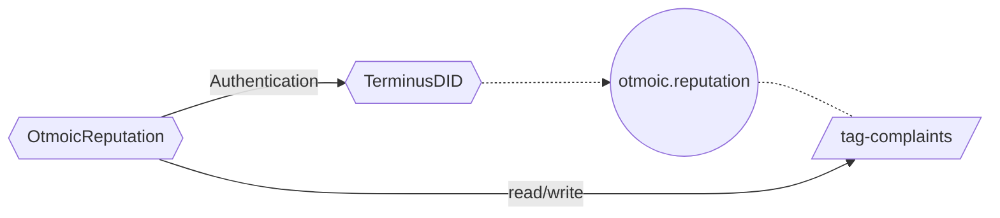
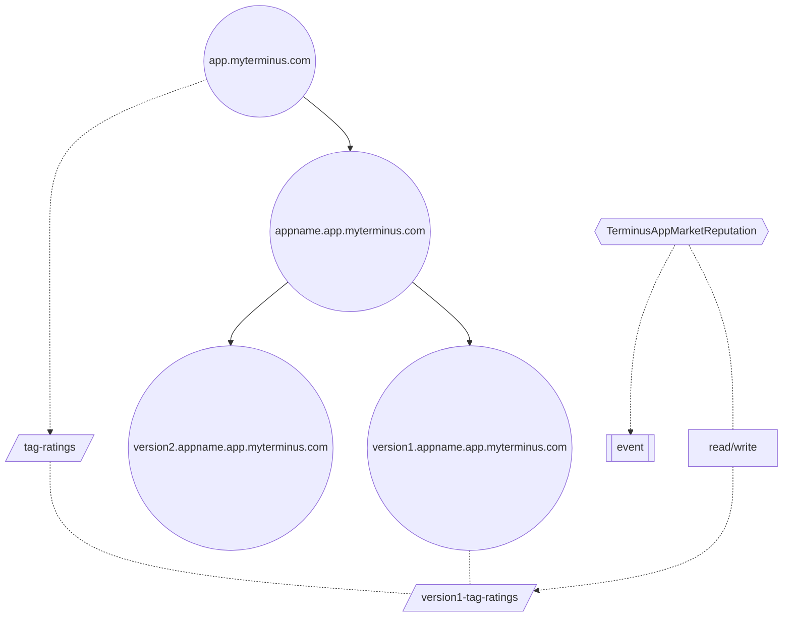

# 智能合约

Snowinning 协议的智能合约包含两部分。


- [TerminusDID](https://github.com/beclab/terminusdid-contract-system/blob/main/src/core/TerminusDID.sol) 合约扮演了关键角色，它充当了 [DID 注册表](./concepts.md#did-注册表)。查看[合约详情](https://optimistic.etherscan.io/address/0x5da4fa8e567d86e52ef8da860de1be8f54cae97d)。
- 第三方协议可以基于 [TerminusDID](https://github.com/beclab/terminusdid-contract-system/blob/main/src/core/TerminusDID.sol) 扩展声誉。目前已有以下声誉协议：
  - [Otmoic Trader Reputation](https://github.com/otmoic/reputation-contract-evm/blob/main/contracts/Reputation.sol)。查看[合约详情](https://optimistic.etherscan.io/address/0x3179CE5fAB68C0286Da85f3d61BcE7116815e799)。
  - [Application Reputation](https://github.com/beclab/terminusdid-contract-system/blob/main/src/taggers/TerminusAppMarketReputation.sol)。查看[合约详情](https://optimistic.etherscan.io/address/0x08065353D266121938B93D4B1071Bb52CD0C0EE4)。

## TerminusDID

TerminusDID 合约管理一个来源于 [Domain](./terminus-name.md#域名类型) 的层级结构。


### 节点

每个节点拥有若干默认属性。部分域名可转换为 Terminus Name。

| 属性            | 描述                                                                                                                                                   |
| -------------- |------------------------------------------------------------------------------------------------------------------------------------------------------|
| name           | [域名](./terminus-name.md#domainname)，部分域名可以与 Terminus Name 互换                                                                                         |
| id             | 每个节点同时是一个 NFT，遵循 **ERC-721** 标准。其 id 作为这个 NFT 的唯一标识符，通过`keccak256(name)`计算得出                                                                         |
| did,owner      | 节点中的`owner`和`did`是同义的，源自相同的助记词。更多细节请查阅[此处](./concepts.md#去中心化标识符-did)。<br> 存储 owner 有助于符合 **BIP44** 规范，便于在 EVM 合约中进行高效的签名验证。每个节点有一个`owner`，负责修改节点详情。 |
| note           | 目前有三种类型：个人、组织、实体                                                                                                                                     |
| allowSubdomain | 表示是否为叶节点。若为`False`，则该节点无法生成更多子节点。                                                                                                                    |

节点默认属性的示例：

```json
{
  "id": "0xbf90de759829bfa3d2b10e4c4a7101e3b116f70b9a5431951ff9d83a4c8e3ceb",
  "name": "olivia.myterminus.com",
  "did": "did:key:z6MkuhT5kYegHaJxirMaHxuqzJhGZk5r32Ct5nYVRQWpN31q",
  "note": "individual",
  "owner": "0x1404C95b2Cb2E46E03650bc02f83364A92f8DA9D",
  "allowSubdomain": true
}
```

### 所有者

不同节点的所有权如下：

- 系统<br>
  如 `root`、`com`、`io` 这类抽象节点的所有者属于 Terminus 团队。

- 个人<br>
  `myterminus.com` 属于[个人域名](./terminus-name.md#个人域名)，所有者为 Terminus 团队。<br>
  `alice.myterminus.com`、`bob.myterminus.com` 属于个人 Terminus 名称，所有者为用户本人。

- 组织<br>
  `org1.com`、`org.io` 属于[组织域名](./terminus-name.md#组织域名)，所有者为该域的管理员。<br>
  `alice.org1.com`、`bob.org2.io` 属于组织 Terminus 名称，所有者为用户本人。

- 实体<br>
  `Application Score` 属于[实体域名](./terminus-name.md#实体域名)，所有者为实体的申请者。

组织管理员和用户可以参考[域管理](contract-manager.md)来管理自己的节点和子节点。

:::info 信息
项目稳定后，所有权将由 Terminus 团队转移到 DAO 组织的多签名地址。
:::

### 标签

[标签](https://github.com/beclab/terminusdid-contract-system/blob/main/src/core/TagRegistry.sol)机制允许 [TerminusDID](https://github.com/beclab/terminusdid-contract-system/blob/main/src/core/TerminusDID.sol) 合约扩展存储在节点上的元数据。

例如，如果你是管理组织域的企业，并希望为组织下每个员工添加员工 ID 属性，则需要基于标签进行扩展。

:::info 注意
标签系统允许你在链上以特定编码格式（ABI）存储多种数据类型，如`uint`、`int`、`address`、`boolean`、`bytes`、`string`、`structure`、`fixed length array`和`variable length array` 。存储或查询数据前，必须先定义相应的数据类型。所定义的数据类型将适用于你账户的节点及其所有子节点。此外，系统通过**definer、用户和标签名**来唯一地索引数据。

对于包含复杂结构或数组的数据，如果每次更新都对整个标签进行，将会导致大量不必要的 Gas 消耗。因此，，我们的系统支持单独更新数据结构中的单个字段或操作数组中的单个元素。当需要更新特定部分的数据时，除了需要提供**definer、用户和标签名**之外，还需要提供数据的**路径**，即结构内的变量名。
:::

#### 自定义标签

| 字段        | 描述                                                                                 |
| ---------- | ---------------------------------------------------------------------------------- |
| name       | 本标签的名称                                                                        |
| did        | 定义此标签的 DID                                                                     |
| abiType    | 本标签的数据类型，遵循 **abi** 编码规范，也支持定义复杂结构                                   |
| fieldNames | 在定义复杂结构时，内部子结构或数据的名称在二维数组中被展平                                   |

你可以[在此处](contract-tdid.md)了解更多信息。

#### 应用范围

节点的自定义标签的所有者/did 仅对该节点及其子节点有效。

#### Tagger

Tagger 是标签内的一个必要信息，与定义中的信息不同。Tagger 可能会频繁更变。
Tagger 代表有权限修改标签值的独特实体，可以是钱包地址或合约。

> [!NOTE]
> 我们建议你使用合约作为 Tagger。
>
> - 根据多个官方实例，你可以采用 DID 合同账户来进行全面的操作者身份认证，并能实现更细致的自定义权限控制。
> 对于那些结构复杂或有特殊规格要求的标签数据，将 Tagger 设置为合同账户可以在链上检验数据格式或制定更全面的自定义规则。例如，对于官方标签中的 RSAPubKey 值，我们会在链上验证其 Pkcs8 ASN.1 格式的字节数据，防止设置无法解析的值。

#### 应用场景

在 Root 节点，我们提供了以下几种标签：

- RSAPubKey：用户可以发布自己的 RSA 公钥，便于第三方利用这个公钥发送加密消息。
- AuthAddresses：用户可以声明自己的钱包地址。
- DNSARecord：用户可以声明边缘节点的 DNS A 记录。

:::info 关于 AuthAddresses
此标签的数据对以下功能至关重要：

- 设置头像

用户在系统中设置头像时，可以任选自己所持有的 NFT 图片。系统通过检查 AuthAddresses 中是否有该 NFT 的所有者地址来确认用户的所有权。

- Otmoic lp

Otmoic lp 作为一个拥有 TerminusName 的账户进行操作。在签署交易信息时，会验证签名者的地址是否在 AuthAddresses 中记录。

由于涉及到其他钱包，仅验证交易发起人的身份是不够的。因此，我们设计了以下操作步骤：

用户需使用已公开的地址和 DID 所有者身份，根据 EIP712 标准签署信息，并在签名后 30 分钟内提交至合约进行验证。

```json
{
  "address": "0x10FE2771907B0c4245695daD7e9Ed064d45860f8",
  "algorithm": 0, // 0: ECDSA
  "domain": "olivia.myterminus.com",
  "signAt": "1714287578",
  "action": 0 //0: Add   1: Remove
}
```

:::
## 声誉

我们可以基于 Tagger 创建高度灵活的[声誉](concepts.md#声誉)协议。

:::info 链上声誉
实施链上声誉系统时，最关键的元素包括：

- 抽象并表现待评估的对象
- 评估对象并存储必要信息
- 认证评估者的身份

针对这些要素，TerminusDID 提供了全面的解决方案。我们可以使用个人和实体类型的 DID 来代表待评估的对象，利用标签（Tags）存储扩展的元数据，并使用 TerminusDID 内建的权限管理功能来验证身份。在接下来的两个案例中，你可以了解更多细节。

:::

### Otmoic Trader Reputation

Otmoic 的信誉合约使用 DID 拥有者的 EIP712 签名进行身份验证，随后将被投诉的`bidid`存储在`otmoic.reputation`实体的`complaints`字段中。

:::info 部署

1. 在 TerminusDID 合约中创建实体 `otmoic.reputation`。
2. 定义一个名为`complaints`的标签。
3. 部署 Otmoic 交易者声誉[合约](https://optimistic.etherscan.io/address/0x3179CE5fAB68C0286Da85f3d61BcE7116815e799)。
4. 将`complaints`的 Tagger 设置为 Otmoic Trader Reputation。
   :::

:::info 使用

1. 使用 DID 拥有者按照 EIP712 标准签署交易信息。
2. 将交易信息及签名提交至 Otmoic Trader Reputation。
   :::

:::info 结构



:::

### Application Reputation

1. 在 `app.myterminus.com` 上定义名为`ratings`的标签，并将 Application Reputation 合约设置为 Tagger。
2. 当应用有新版本时，在区块链上创建 **`<version>.<appname>.app.myterminus.com`**。
3. 用户签名评论或评分信息，并提交至 Application Reputation 合约。
4. Application Reputation 合约将评分信息保存至 `<version>.<appname>.app.myterminus.com` 的 Ratings 中，并以事件形式发布评论信息。

:::info



:::
