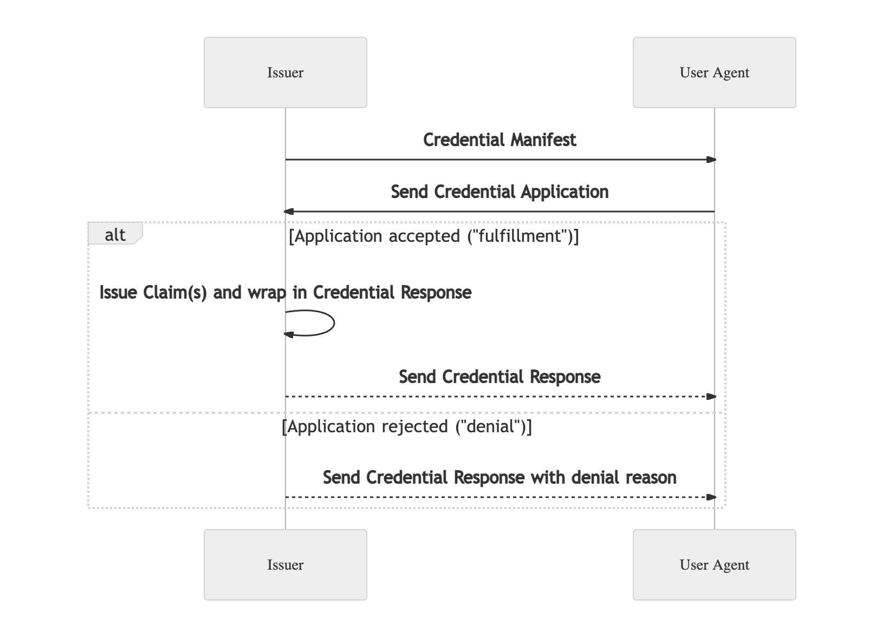
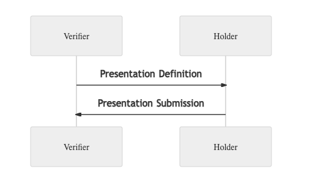

# VC Service

本文的目的是希望在帮助你了解如何配置各类 Schema 后, 通过 Terminus 提供的 [verifiable-credential-gate](https://github.com/Above-Os/verifiable-credential-gate)，[did-gate](https://github.com/Above-Os/did-gate) 和 tbd 团队提供的 [SSI Service](https://github.com/TBD54566975/ssi-service) ，打造自己场景的 Issuer 和 Verifier。

:::tip
如果你想从事更底层的开发，可以结合 [SSI SDK](https://github.com/TBD54566975/ssi-sdk) 的源代码阅读 [协议标准](#reference)
:::

## 介绍

在 [VC](concepts.md#可验证凭证) 一节中，我们介绍了 VC 申请的基本流程。

在实际的 Wallet，Verifier 和 Issuer 的沟通过程中，会接触到更多名词，我们在这里梳理下：

| 术语                      | 定义                                                                                                                                                                                                                                                                                   |
| ------------------------- |--------------------------------------------------------------------------------------------------------------------------------------------------------------------------------------------------------------------------------------------------------------------------------------|
| Holder                    | Holder 是拥有一个或多个 Verifiable Credential 的实体。同时，Holder 也是向 Verifier 提交证明以满足 Presentation Definition 描述要求的实体。                                                                                                                                                                            |
| Issuer                    | Issuer 是一个实体的角色，通过对一个或多个主题断言声明，创建 Verifiable Credential，并将其传递给 Holder。                                                                                                                                                                                                               |
| Verifier                  | Verifier 是定义他们从 Holder 需要哪些证明（通过 Presentation Definition）以继续进行交互的实体。                                                                                                                                                                                                                 |
| Verifiable Credential     | 是一种防篡改的凭证，其作者身份可以通过加密方式验证。Verifiable Credential 可用于构建 Verifiable Presentation，后者同样可以通过加密验证。凭证中的声明可以关于不同的主题。PEX 接受三种形式的 Verifiable Credential：1. 系统中称为 IVerifiableCredential 的 JSON_LD，2. 系统中称为 JwtWrappedVerifiableCredential 的 JWT-Wrapped VC，3. 有效的 Verifiable Credential JWT 字符串。 |
| Verifiable Presentation   | 是一种防篡改的展示，其数据的作者身份在经过加密验证过程后可以被信任。                                                                                                                                                                                                                                                   |
| Manifest                  | Credential Manifest 用于描述哪些凭证可供发行。                                                                                                                                                                                                                                                    |
| Application               | Holder 向 Issuer 提交的格式，里面包含了必要的信息以申请 Verifiable Credential。                                                                                                                                                                                                                           |
| Presentation Definition   | Presentation Definition 是定义 Verifier 所需证明的对象。                                                                                                                                                                                                                                        |
| Presentation              | 来自一个或多个 Issuer 发行的一个或多个 Verifiable Credential 派生的数据。                                                                                                                                                                                                                                 |
| Submission                | -                                                                                                                                                                                                                                                                                    |
| Definition                | -                                                                                                                                                                                                                                                                                    |
| Schema                    | 不同的 Manifest、Application、Credential、Presentation、Definition 都需通过 JSON 格式定义的 Schema。系统通过这些 Schema 来验证提交的数据格式是否正确，确保数据处理符合业务流程要求。                                                                                                                                                      |
## Issuer Service



流程

1. Holder 从 Issuer 处 Get Manifest
2. Holder 自己 Sign and Submit Application
3. Issuer 自动或者手动 Review Application
4. Holder 从 Issuer 拿到 Review 的结果，如果通过，会获取到 VC，反之拿到被拒绝的理由

### Manifest

这个文件会返回给 Holder。
outputDescriptors 这个参数是用来告诉钱包如何展示 VC 的。
presentationDefinition 实际上是后续 manifest_presentation 文件，用来确认用户提交上来的 Application 的格式

```json
{
  "name": "Facebook Verifiable Credential Manifest",
  "description": "Facebook Verifiable Credential Manifest",
  "issuerDid": "",
  "issuerName": "",
  "outputDescriptors": [
    {
      "id": "",
      "schema": "",
      "name": "Facebook Verifiable Credential Manifest",
      "description": "Facebook Verifiable Credential Manifest",
      "display": {
        "title": {
          "path": ["$.credentialSubject.name", "$.vc.credentialSubject.name"],
          "schema": { "type": "string" }
        },
        "subtitle": {
          "path": ["$.credentialSubject.title", "$.vc.credentialSubject.title"],
          "schema": { "type": "string" }
        },
        "description": {
          "path": [
            "$.credentialSubject.description",
            "$.vc.credentialSubject.description"
          ],
          "schema": { "type": "string" }
        },
        "properties": [
          {
            "path": ["$.credentialSubject.id", "$.vc.credentialSubject.id"],
            "schema": { "type": "string" },
            "label": "ID"
          },
          {
            "path": [
              "$.credentialSubject.email",
              "$.vc.credentialSubject.email"
            ],
            "schema": { "type": "string" },
            "label": "Email"
          }
        ]
      },
      "styles": {
        "background": {
          "color": "#FFFFFF"
        },
        "text": {
          "color": "#000000"
        }
      }
    }
  ],
  "format": {
    "jwt_vc": {
      "alg": ["EdDSA"]
    }
  },
  "presentationDefinition": {}
}
```

### Manifest Presentation

issuer 会用这个文件校验 Holder 提交的 Application 格式是否合法

```json
{
  "name": "Facebook Manifest Presentation Definition",
  "purpose": "Provide your token required to Facebook",
  "inputDescriptors": [
    {
      "id": "token",
      "name": "Access Token",
      "purpose": "Provide your token required to Facebook",
      "format": {
        "jwt_vc": {
          "alg": ["EdDSA"]
        }
      },
      "constraints": {
        "fields": [
          {
            "path": ["$.credentialSubject.token"]
          }
        ],
        "subject_is_issuer": "preferred"
      }
    }
  ],
  "author": ""
}
```

### Application Verifiable Credential

用户虽然在客户端构造 vc 数据时只要 manifest_presentation，但是服务器需要一个 schema 来校验 manifest_presentation 是否符合格式要求。
这个文件会返回给 Holder 让 Holder 知道需要提交验证的数据格式。
在 Facebook，Twiiter，Gmail 这种场景下，用户在客户端登录，获得 acesstoken，然后将 acesstoken 提交给 Issuer 服务器进行，Issuer 服务器通过 acesstoken 到 Facebook 等服务器上获取用户的基本信息。所以用户只要提交 token 即可，内容简单。
但如果是 KYC 场景，用户则需要提交姓名，身份证照片甚至验证视频等，这个文件的字段就会复杂很多

```json
{
  "author": "",
  "name": "Facebook Verifiable Credential Request Schema",
  "schema": {
    "$id": "facebook-schema-1.0",
    "$schema": "https://json-schema.org/draft/2020-12/schema",
    "description": "Facebook Verifiable Credential Schema",
    "type": "object",
    "properties": {
      "token": {
        "type": "string"
      }
    },
    "required": ["token"],
    "additionalProperties": true
  },
  "sign": false
}
```

### Verifiable Credential

Issuer 返回给 Holder 的 VC 格式

```json
{
  "author": "",
  "name": "Facebook Verifiable Credential Schema",
  "schema": {
    "$id": "facebook-schema-1.0",
    "$schema": "https://json-schema.org/draft/2020-12/schema",
    "description": "Facebook Verifiable Credential Schema",
    "type": "object",
    "properties": {
      "name": {
        "type": "string"
      },
      "title": {
        "type": "string"
      },
      "description": {
        "type": "string"
      },

      "facebook_name": {
        "type": "string"
      },
      "profile_image": {
        "type": "string"
      },
      "email": {
        "type": "string"
      },
      "facebook_id": {
        "type": "string"
      },
      "picture_is_silhouette": {
        "type": "boolean"
      }
    },
    "required": ["name", "title", "description", "facebook_name"],
    "additionalProperties": true
  },
  "sign": false
}
```

## Verifer Service

流程可以参考[Presentation Exchange](https://identity.foundation/presentation-exchange/)


### Presentation Definition

Verifer 会把文件返回给 Holder，Holder 根据要求将 VC 内容填写进去后打包成符合格式要求的 Submission 返回给 Verifer

```json
{
  "name": "Facebook Basic Info Presentation Definition",
  "purpose": "Provide your facebook basic info",
  "inputDescriptors": [
    {
      "id": "name",
      "name": "Name",
      "purpose": "Provide vc name",
      "format": {
        "jwt_vc": {
          "alg": ["EdDSA"]
        }
      },
      "constraints": {
        "fields": [
          {
            "path": ["$.credentialSubject.name"]
          }
        ],
        "subject_is_issuer": "preferred"
      }
    },
    {
      "id": "title",
      "name": "Title",
      "purpose": "Provide vc title",
      "format": {
        "jwt_vc": {
          "alg": ["EdDSA"]
        }
      },
      "constraints": {
        "fields": [
          {
            "path": ["$.credentialSubject.title"]
          }
        ],
        "subject_is_issuer": "preferred"
      }
    },
    {
      "id": "description",
      "name": "description",
      "purpose": "Provide vc description",
      "format": {
        "jwt_vc": {
          "alg": ["EdDSA"]
        }
      },
      "constraints": {
        "fields": [
          {
            "path": ["$.credentialSubject.description"]
          }
        ],
        "subject_is_issuer": "preferred"
      }
    },

    {
      "id": "facebook_name",
      "name": "Provide your facebook name",
      "purpose": "Provide your facebook name",
      "format": {
        "jwt_vc": {
          "alg": ["EdDSA"]
        }
      },
      "constraints": {
        "fields": [
          {
            "path": ["$.credentialSubject.facebook_name"]
          }
        ],
        "subject_is_issuer": "preferred"
      }
    },
    {
      "id": "profile_image",
      "name": "Provide your facebook profile image",
      "purpose": "Provide your facebook profile image",
      "format": {
        "jwt_vc": {
          "alg": ["EdDSA"]
        }
      },
      "constraints": {
        "fields": [
          {
            "path": ["$.credentialSubject.profile_image"]
          }
        ],
        "subject_is_issuer": "preferred"
      }
    },
    {
      "id": "email",
      "name": "Provide your facebook email email info",
      "purpose": "Provide your facebook email info",
      "format": {
        "jwt_vc": {
          "alg": ["EdDSA"]
        }
      },
      "constraints": {
        "fields": [
          {
            "path": ["$.credentialSubject.email"]
          }
        ],
        "subject_is_issuer": "preferred"
      }
    },
    {
      "id": "facebook_id",
      "name": "Provide your facebook id",
      "purpose": "Provide your facebook id",
      "format": {
        "jwt_vc": {
          "alg": ["EdDSA"]
        }
      },
      "constraints": {
        "fields": [
          {
            "path": ["$.credentialSubject.facebook_id"]
          }
        ],
        "subject_is_issuer": "preferred"
      }
    },
    {
      "id": "picture_is_silhouette",
      "name": "Provide your facebook Picture is Silhouette",
      "purpose": "Provide your facebook picture_is_silhouette",
      "format": {
        "jwt_vc": {
          "alg": ["EdDSA"]
        }
      },
      "constraints": {
        "fields": [
          {
            "path": ["$.credentialSubject.picture_is_silhouette"]
          }
        ],
        "subject_is_issuer": "preferred"
      }
    }
  ],
  "author": ""
}
```

## 启动服务

TODO

## Reference

以下引用来自 [SSI SDK](https://github.com/TBD54566975/ssi-sdk) 项目

### 规范

以下是本库目前支持的一系列标准规范。随着库的发展，这些支持的标准可能会有所变化。

- [分布式标识符 (DIDs) v1.0](https://www.w3.org/TR/did-core/) - W3C 建议标准，2021年8月3日
- [可验证凭证数据模型 v1.1](https://www.w3.org/TR/vc-data-model/) - W3C 推荐标准，2021年11月9日
  - 支持 [链接数据证明](https://www.w3.org/TR/vc-data-model/#data-integrity-proofs) 格式。
  - 支持 [VC-JWT 及 VP-JWT](https://www.w3.org/TR/vc-data-model/#json-web-token) 格式。
- [可验证凭证 JSON 架构规范](https://w3c-ccg.github.io/vc-json-schemas/v2/index.html) - 草案社区小组报告，2021年9月21日
- [展示交换 2.0.0](https://identity.foundation/presentation-exchange/) - 工作组草案，2022年3月
- [钱包渲染草案](https://identity.foundation/wallet-rendering/)，2022年6月
- [凭证清单](https://identity.foundation/credential-manifest/) - 草案，2022年6月
- [状态列表 2021](https://w3c-ccg.github.io/vc-status-list-2021/) - 草案社区小组报告，2022年4月4日

### 签名方法

> - [数据完整性 1.0](https://w3c.github.io/vc-data-integrity/) - 草案社区小组报告
> - [链接数据加密套件注册处](https://w3c-ccg.github.io/ld-cryptosuite-registry/) - 草案社区小组报告，2020年12月29日
> - [JSON Web 签名 2020](https://w3c-ccg.github.io/lds-jws2020/) - 草案社区小组报告，2022年2月9日
> - [VC 证明格式测试套件，带 JSON Web 签名的 VC 数据模型](https://identity.foundation/JWS-Test-Suite/) - 非正式草案，2022年3月9日 此实现与 JWS 测试套件的兼容性可以在此处找到。
>  - 支持 JWT 和链接数据证明格式，符合 [JOSE 标准](https://jose.readthedocs.io/en/latest/)。
