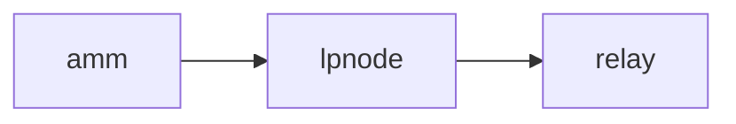
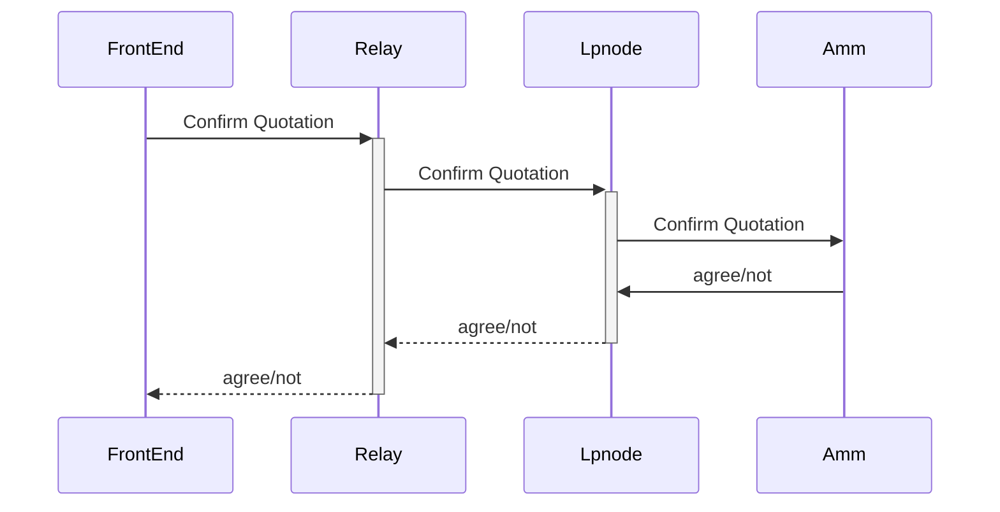
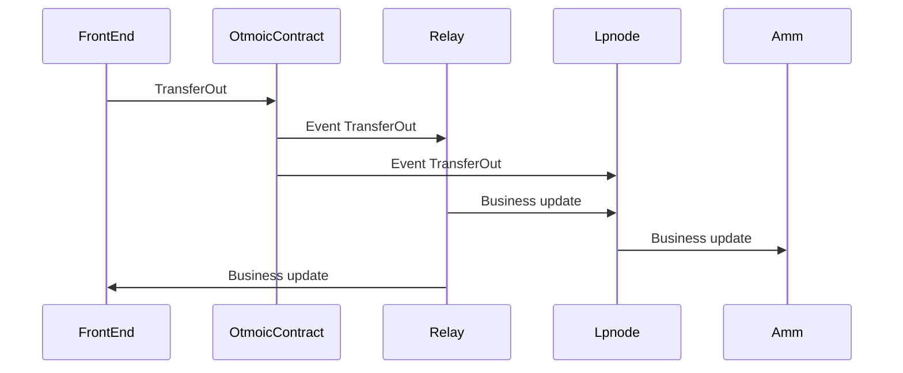
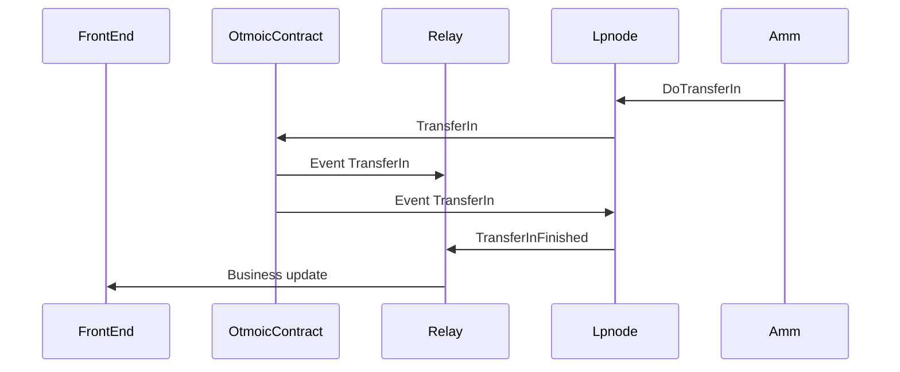
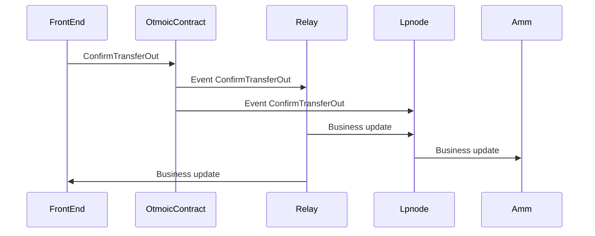
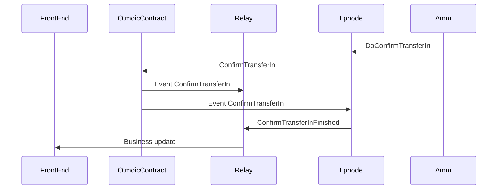

# Otmoic

## Introduction

Otmoic 是一个基于 Snowinning Protocol 的，无需第三方信任的，为 Depin，AI Agent，Crypto Trading 打造的自动化价值交换协议。

它的愿景是: Giving Public Goods a Fair Price。

Otmoic Protocol 在设计时有以下的特色：

- 为 Trader 和 Liquidity Provider 提供了链上的 [Reputation](../../developer/contribute/snowinning/concepts.md#reputation)机制，解决 Free Mint 问题。
- 支持基于 [Verifiable Credential](../../developer/contribute/snowinning/concepts.md#verifiable-credential) 的 [KYC](#kyc)。
- 价格发现基于 RFQ。
- 链上的交易基于原子交换。
- 通过在 Terminus OS 里安装应用，支持 Liquidity Provider 自动做市。

通过上述设计，可以让 Otmoic Protocol 广泛应用于 DePin，AI Bot，Creator Economy，Crypto Trading，Crypto Cross-Chain，Fiat and Crypto Gateway 等场景。

## 开源项目

你可以在这里查看协议的代码：
:::info 代码仓库

- 合约

  - [contract-evm](https://github.com/otmoic/contract-evm)

- Liquidity Provider Node

  - [lpnode](https://github.com/otmoic/lpnode)
  - [lpnode-admin](https://github.com/otmoic/lpnode-admin)
  - [lpnode-dashboard](https://github.com/otmoic/lpnode-dashboard)
  - [lpnode-monitor](https://github.com/otmoic/lpnode-monitor)
  - [lpnode-graphql](https://github.com/otmoic/lpnode-graphql)
  - AMM
    - [lpnode-amm](https://github.com/otmoic/lpnode-amm)
    - [lpnode-index-market](https://github.com/otmoic/lpnode-index-market)
    - [lpnode-exchange-adapter](https://github.com/otmoic/lpnode-exchange-adapter)
    - [lpnode-amm-analyze](https://github.com/otmoic/lpnode-amm-analyze)

- Chain Client

  - [chainclient-evm](https://github.com/otmoic/chainclient-evm)

- Example
  - [lpnode-amm-example](https://github.com/otmoic/lpnode-amm-example)

:::

以下是协议的细节

## Spec

### Resources

:::info Data

- BridgeInfo

| name         | type   | required | description                                           |
| ------------ | ------ | -------- | ----------------------------------------------------- |
| src_chain_id | uint   | ✔        | 用户换出代币的链码，遵循 bip44 中的链码               |
| dst_chain_id | uint   | ✔        | 用户换入代币的链码，遵循 bip44 中的链码               |
| src_token    | String | ✔        | 用户换出的 token                                      |
| dst_token    | String | ✔        | 用户换入的 token                                      |
| bridge_name  | String | ✔        | <src_chain_id>-<src_token>-<dst_chain_id>-<dst_token> |

- QuoteBase

| name               | type       | required: amm -> lpnode | required: lpnode -> relay | required: ask reply: amm -> lpnode | required: ask reply: lpnode -> relay | description                                                   |
| ------------------ | ---------- | ----------------------- | ------------------------- | ---------------------------------- | ------------------------------------ | ------------------------------------------------------------- |
| bridge             | BridgeInfo |                         | ✔                         |                                    | ✔                                    | 此次报价所属的交易对信息                                      |
| lp_bridge_address  | String     |                         |                           |                                    | ✔                                    | lp 的收款地址                                                 |
| lp_node_uri        | String     |                         |                           |                                    | ✔                                    | lp 程序的公网访问地址, relay 依赖此地址与 lpnode 通信         |
| quote_hash         | String     |                         |                           | ✔                                  | ✔                                    | 本次报价的 hash, 作用报价的唯一标识                           |
| price              | String     |                         |                           | ✔                                  | ✔                                    | 兑换价格, 以 token 的整数位为单位进行报价                     |
| native_token_price | String     |                         |                           | ✔                                  | ✔                                    | 兑换 native token 的价格, 同样以 token 的整数位为单位进行报价 |
| native_token_max   | String     |                         |                           | ✔                                  | ✔                                    | 本次最多可以兑换多少 native token                             |
| native_token_min   | String     |                         |                           | ✔                                  | ✔                                    | 如果要兑换 native token, 最少需要兑换多少                     |

- QuoteAuthenticationLimiter

| name               | type   | required | description                             |
| ------------------ | ------ | -------- | --------------------------------------- |
| limiter_state      | String | ✔        | 是否开启限制器, “on”为开启, “off”为关闭 |
| country_white_list | String |          | 按国家进行限制,白名单列表,以“,”分割     |
| country_black_list | String |          | 按国家进行限制,黑名单列表,以“,”分割     |
| min_age            | String |          | 可以进行交易的最小年纪                  |

> [!NOTE]
>
> - 如果开启限制器, 则所有未在 relay 进行 kyc 的对手方, 都将不支持
> - 黑名单和白名单仅有 1 个生效, 白名单优先级更高, 白名单为空时黑名单生效
> - 如配置白名单国家, 则其余国家全为黑名

- LPInfo

| name         | type   | required | description                            |
| ------------ | ------ | -------- | -------------------------------------- |
| name         | String | ✔        | lp 的名字, 此名字必须使用 TerminusName |
| profile      | String | ✔        | lp 的对外介绍信息, 内容无限制          |
| credit_score | uint   | ✔        | lp 在当前 relay 中的信用分             |

> [!NOTE]
>
> - credit_score 的计算由两部分组成, 基础分和投诉扣分
>   - 基础分依据最近一段时间的交易数,平均等待时间等信息计算得出
>   - 投诉扣分是在交易有投诉,并且投诉情况被系统确认的情况下进行永久计分

- Quote

| name                   | type                       | required | description      |
| ---------------------- | -------------------------- | -------- | ---------------- |
| quote_base             | QuoteBase                  | ✔        | 报价信息         |
| authentication_limiter | QuoteAuthenticationLimiter | ✔        | 此次报价的限制器 |
| lp_info                | LPInfo                     | ✔        | lp 信息          |
| timestamp              | Long                       | ✔        | 此次报价的时间戳 |

- Ask

| name   | type   | required | description                                      |
| ------ | ------ | -------- | ------------------------------------------------ |
| bridge | String | ✔        | 交易对的名字,与 BridgeInfo 中的 bridge_name 相同 |
| amount | String | ✔        | 期望换出的 token 数量                            |

- SwapAssetInformation

| name                   | type   | required: FE -> relay | required: relay -> lpnode | required: lpnode -> amm | description                          |
| ---------------------- | ------ | --------------------- | ------------------------- | ----------------------- | ------------------------------------ |
| bridge_name            | String | ✔                     | ✔                         | ✔                       | 交易对的名字                         |
| lp_id                  | String | ✔                     | ✔                         | ✔                       | lp 的名字                            |
| sender                 | String | ✔                     | ✔                         | ✔                       | 执行换出 token 的钱包地址            |
| amount                 | String | ✔                     | ✔                         | ✔                       | 换出的 token 数量                    |
| dst_address            | String | ✔                     | ✔                         | ✔                       | 换入 token 的接收地址                |
| dst_amount             | String | ✔                     | ✔                         | ✔                       | 换入 token 的数量                    |
| dst_native_amount      | String | ✔                     | ✔                         | ✔                       | 换入操作附带交换的 native token 数量 |
| step_time_lock         | Long   | ✔                     | ✔                         | ✔                       | 每一步操作的限制时间                 |
| agreement_reached_time | Long   | ✔                     | ✔                         | ✔                       | 双方达成交易的时间                   |
| requestor              | String | ✔                     | ✔                         | ✔                       | 交换发起方的身份认证地址             |
| user_sign              | String | ✔                     | ✔                         | ✔                       | 用户对于交易信息的签名               |
| lp_sign                | String |                       |                           |                         | lp 对于交易信息的签名                |
| quote                  | Quote  | ✔                     | ✔                         | ✔                       | 交易发起方所选择的报价               |
| system_fee_src         | uint   |                       | ✔                         | ✔                       | 系统当前合约所收取的手续费-换出链    |
| system_fee_dst         | uint   |                       | ✔                         | ✔                       | 系统当前合约所收取的手续费-换入链    |
| dst_amount_need        | String |                       | ✔                         | ✔                       | 是否交换 token                       |
| dst_native_amount_need | String |                       | ✔                         | ✔                       | 是否交换 native token                |
| append_information     | String |                       |                           |                         | 附加信息                             |

> [!NOTE]
> `dst_amount_need`和`dst_native_amount_need`由 relay 基于本次交换的信息计算得出
> `system_fee_dst`和`system_fee_src`由 relay 从链上获取
>
> 上述四条信息均非交换流程的必要参数, 目的仅为降低后续流程及其他模块的实现难度。

- **关于每一步的操作时间限制**
  - transferOut: `agreement_reached_time + 1 \* step_time_lock`之前调用，否则调用失败。
  - transferIn: `agreement_reached_time + 2 \* step_time_lock`之前调用，否则调用失败。
  - confirmTransferOut:
    - 使用交易发起者提供的 hashlock 进行验证时, `agreement_reached_time + 3 \* step_time_lock`之前调用，否则调用失败。
    - 使用 relay 提供的 hashlock 进行验证时, `agreement_reached_time + 6 \* step_time_lock`之前调用，否则调用失败。
  - confirmTransferIn: `agreement_reached_time + 5 \* step_time_lock`之前调用，否则调用失败。
  - refundTransferOut: `agreement_reached_time + 7 \* step_time_lock`之后调用，否则调用失败。
  - refundTransferIn: `agreement_reached_time + 7 \* step_time_lock`之后调用，否则调用失败。

> [!NOTE]
> 预期的正常操作流程和时间限制是：
>
> - transferOut: `1 \* step_time_lock`
> - transferIn: `2 \* step_time_lock`
> - confirmTransferOut: `3 \* step_time_lock`
> - confirmTransferIn: `4 \* step_time_lock`
>
> 但是, 考虑到交换双方可能出现的作弊行为, 所以`confirmTransferOut`和`confirmTransferIn`的时间限制需要调整。
>
> - 如果`4 * step_time_lock`时间到达后, LP 未进行`ConfirmTransferIn`操作, 此时 relay 会主动介入, 进行`ConfirmTransferIn`操作, 所以`4 * step_time_lock ~ 5 * step_time_lock`的时间段是留给 relay 进行防作弊操作的时间。
> - `TransferIn`所使用的 hashlock 由交换发起者提供, 如果交易发起者在`5 * step_time_lock`的时间边界直接操作`ConfirmTransferIn`, 则 relay 会在此时介入, 使用 relay 提供的 hashlock 进行`ConfirmTransferOut`, `5 * step_time_lock ~ 6 * step_time_lock`的时间段就是此流程的执行时间。

- **关于交易签名**

交易发起方需要使用`requestor`对交易信息进行签名, 签名后的结果填入`user_sign`字段
lp 则需要使用已在 DID 合约中认证过的地址对交易进行签名, 签名后的结果填入`lp_sign`字段

> [!NOTE]
> 在 evm 类型的链中, 签名遵循 EIP712 进行。
> 其他类型的链, 签名遵循链上支持的类似协议进行。

- EIP712 Types

```
types: {
	EIP712Domain: [
		{ name: 'name', type: 'string' },
		{ name: 'version', type: 'string' },
		{ name: 'chainId', type: 'uint256' },
	],
	Message: [
		{ name: 'src_chain_id', type: 'uint256' },
		{ name: 'src_address', type: 'string' },
		{ name: 'src_token', type: 'string' },
		{ name: 'src_amount', type: 'string' },
		{ name: 'dst_chain_id', type: 'uint256' },
		{ name: 'dst_address', type: 'string' },
		{ name: 'dst_token', type: 'string' },
		{ name: 'dst_amount', type: 'string' },
		{ name: 'dst_native_amount', type: 'string' },
		{ name: 'requestor', type: 'string' },
		{ name: 'lp_id', type: 'string' },
		{ name: 'step_time_lock', type: 'uint256' },
		{ name: 'agreement_reached_time', type: 'uint256' },
	],
}
```

BidId 生成规范

```
sha3(
	agreement_reached_time +
	src_chain_id +
	lp_bridge_address +
	src_token +
	dst_chain_id +
	dst_address +
	dst_token +
	amount +
	dst_amount +
	dst_native_amount +
	requestor +
	lp_id +
	step_time_lock +
	user_sign +
	lp_sign
)
```

- PreBusiness

| name                   | type                 | required: relay -> lpnode | required: lpnode -> amm | required: relay -> FE | description                               |
| ---------------------- | -------------------- | ------------------------- | ----------------------- | --------------------- | ----------------------------------------- |
| swap_asset_information | SwapAssetInformation | ✔                         | ✔                       |                       | 交换信息                                  |
| hash                   | String               | ✔                         | ✔                       |                       | 交换中主要信息生成的 hash                 |
| relay_hashlock         | String               |                           |                         | ✔                     | relay 提供的 hashlock                     |
| is_kyc                 | Boolean              | ✔                         | ✔                       |                       | 交换发起者是否在 relay 的系统中进行了 kyc |
| kyc_info               | KycInfo              |                           |                         |                       | 交易发起者的完整 kyc 信息                 |
| locked                 | Boolean              |                           |                         | ✔                     | 交易是否达成的状态位                      |

- 关于 KYC Info

用户在 relay 进行 kyc 是需提供链上地址, 在 kyc 完成之后, 使用此地址签名发起的交换会以 kyc 成功的状态与限制器进行匹配, 同时也会像 lp 提供完整的 kyc 信息, 以供确认. 更多关于 kyc 的信息可查看下方的 kyc 章节

- 关于 Lock 标记位

返回给前端的数据中, locked 代码是否达成交易并初步锁定份额, 以下几种情况标记位会为 false

> [!NOTE]
>
> - user_sign 和 其他交换信息计算得出的签名地址与 requestor 地址不符
> - lp_sign 和 其他交换信息计算得出的签名地址没有在链上认证过
> - 交易发起者不满足报价中设置的限制器条件
> - 其他未知原因(lp 可能在余额不足, 价格偏离过大等各种情况下拒绝本次交换请求)

- TransferOut-EVM

此结构为合约方法调用参数

| name                 | type    | required | description                                                         |
| -------------------- | ------- | -------- | ------------------------------------------------------------------- |
| sender               | address | ✔        | 本操作的发起者, 大多数情况下与 requestor 相同, 但并无必须相同的限制 |
| bridge               | address | ✔        | QuoteBase 中 lp_bridge_address                                      |
| token                | address | ✔        | BridgeInfo 中 src_token                                             |
| amount               | uint256 | ✔        | SwapAssetInformation 中 amount                                      |
| hashlock             | bytes32 | ✔        | 交换发起方生成的锁                                                  |
| relayHashlock        | bytes32 | ✔        | PreBusiness 中 relay_hashlock                                       |
| stepTimelock         | uint64  | ✔        | SwapAssetInformation 中 step_time_lock                              |
| dstChainId           | uint64  | ✔        | BridgeInfo 中 dst_chain_id                                          |
| dstAddress           | uint256 | ✔        | SwapAssetInformation 中 dst_address                                 |
| bidId                | bytes32 | ✔        | PreBusiness 中 hash                                                 |
| tokenDst             | uint256 | ✔        | BridgeInfo 中 dst_token                                             |
| amountDst            | uint256 | ✔        | SwapAssetInformation 中 dst_amount                                  |
| nativeAmountDst      | uint256 | ✔        | SwapAssetInformation 中 dst_native_amount                           |
| agreementReachedTime | uint64  | ✔        | SwapAssetInformation 中 agreement_reached_time                      |
| requestor            | string  | ✔        | SwapAssetInformation 中 requestor                                   |
| lpId                 | string  | ✔        | SwapAssetInformation 中 lp_id                                       |
| userSign             | string  | ✔        | SwapAssetInformation 中 userSign                                    |
| lpSign               | string  | ✔        | SwapAssetInformation 中 lpSign                                      |

关于 hashlock

> [!NOTE]
>
> - 交换发起方提供一个 bytes32 数据, 用作 release 时的锁, 并在 Confirm 操作时通过 `keccak256(preimage)` 进行验证, 如果验证成功并且满足其他检查条件, 则可以释放锁定的 token
> - TransferIn 操作与 TransferOut 使用同一把锁
> - 在 ConfirmTransferOut 时, 公开计算 hashlock 所需的 preimage, 之后 lp 就可以使用 preimage 进行 TransferIn 的释放操作

- EventTransferOut-EVM

| name                   | type    | required | description              |
| ---------------------- | ------- | -------- | ------------------------ |
| transfer_id            | bytes32 | ✔        | 本次操作的 id            |
| sender                 | address | ✔        | TransferOut 中的对应数据 |
| bridge                 | address | ✔        | TransferOut 中的对应数据 |
| token                  | address | ✔        | TransferOut 中的对应数据 |
| amount                 | uint256 | ✔        | TransferOut 中的对应数据 |
| hashlock               | bytes32 | ✔        | TransferOut 中的对应数据 |
| relay_hashlock         | bytes32 | ✔        | TransferOut 中的对应数据 |
| step_time_lock         | uint64  | ✔        | TransferOut 中的对应数据 |
| dst_chain_id           | uint64  | ✔        | TransferOut 中的对应数据 |
| dst_address            | uint256 | ✔        | TransferOut 中的对应数据 |
| bid_id                 | bytes32 | ✔        | TransferOut 中的对应数据 |
| token_dst              | uint256 | ✔        | TransferOut 中的对应数据 |
| amount_dst             | uint256 | ✔        | TransferOut 中的对应数据 |
| native_amount_dst      | uint256 | ✔        | TransferOut 中的对应数据 |
| agreement_reached_time | uint64  | ✔        | TransferOut 中的对应数据 |
| requestor              | string  | ✔        | TransferOut 中的对应数据 |
| lp_id                  | string  | ✔        | TransferOut 中的对应数据 |
| user_sign              | string  | ✔        | TransferOut 中的对应数据 |
| lp_sign                | string  | ✔        | TransferOut 中的对应数据 |

- TransferIn-EVM

此结构为合约方法调用参数

| name                   | type    | required | description                                    |
| ---------------------- | ------- | -------- | ---------------------------------------------- |
| sender                 | address | ✔        | 本操作的发起者                                 |
| dst_address            | address | ✔        | SwapAssetInformation 中 dst_address            |
| token                  | address | ✔        | BridgeInfo 中 dst_token                        |
| token_amount           | uint256 | ✔        | SwapAssetInformation 中 dst_amount             |
| eth_amount             | uint256 | ✔        | SwapAssetInformation 中 dst_native_amount      |
| hashlock               | bytes32 | ✔        | EventTransferOut 中 hashlock                   |
| step_time_lock         | uint64  | ✔        | SwapAssetInformation 中 step_time_lock         |
| src_chain_id           | uint64  | ✔        | BridgeInfo 中 src_chain_id                     |
| src_transfer_id        | bytes32 | ✔        | EventTransferOut 中 transfer_id                |
| agreement_reached_time | uint64  | ✔        | SwapAssetInformation 中 agreement_reached_time |

- EventTransferIn-EVM

| name                   | type    | required | description             |
| ---------------------- | ------- | -------- | ----------------------- |
| transfer_id            | bytes32 | ✔        | 本次操作的 id           |
| sender                 | address | ✔        | TransferIn 中的对应数据 |
| receiver               | address | ✔        | TransferIn 中的对应数据 |
| token                  | address | ✔        | TransferIn 中的对应数据 |
| token_amount           | uint256 | ✔        | TransferIn 中的对应数据 |
| eth_amount             | uint256 | ✔        | TransferIn 中的对应数据 |
| hashlock               | bytes32 | ✔        | TransferIn 中的对应数据 |
| step_time_lock         | uint64  | ✔        | TransferIn 中的对应数据 |
| src_chain_id           | uint64  | ✔        | TransferIn 中的对应数据 |
| src_transfer_id        | bytes32 | ✔        | TransferIn 中的对应数据 |
| agreement_reached_time | uint64  | ✔        | TransferIn 中的对应数据 |

- ConfirmTransferOut-EVM

此结构为合约方法调用参数

| name                   | type    | required | description                      |
| ---------------------- | ------- | -------- | -------------------------------- |
| sender                 | address | ✔        | TransferOut 中的对应数据         |
| receiver               | address | ✔        | TransferOut 中的对应数据         |
| token                  | address | ✔        | TransferOut 中的对应数据         |
| token_amount           | uint256 | ✔        | TransferOut 中的对应数据         |
| eth_amount             | uint256 | ✔        | TransferOut 中的对应数据         |
| hashlock               | bytes32 | ✔        | TransferOut 中的对应数据         |
| relay_hashlock         | bytes32 | ✔        | TransferOut 中的对应数据         |
| step_time_lock         | uint64  | ✔        | TransferOut 中的对应数据         |
| preimage               | bytes32 | ✔        | 可以计算出 hashlock 的原项       |
| relay_preimage         | bytes32 | ✔        | 可以计算出 relay_hashlock 的原项 |
| agreement_reached_time | uint64  | ✔        | TransferOut 中的对应数据         |

- EventConfirmTransferOut-EVM

| name        | type    | required | description                       |
| ----------- | ------- | -------- | --------------------------------- |
| transfer_id | bytes32 | ✔        | EventTransferOut 中的 transfer_id |
| preimage    | bytes32 | ✔        | ConfirmTransferOut 中的对应数据   |

- ConfirmTransferIn-EVM

此结构为合约方法调用参数

| name                   | type    | required | description                           |
| ---------------------- | ------- | -------- | ------------------------------------- |
| sender                 | address | ✔        | TransferIn 中的对应数据               |
| dst_address            | address | ✔        | TransferIn 中的对应数据               |
| token                  | address | ✔        | TransferIn 中的对应数据               |
| token_amount           | uint256 | ✔        | TransferIn 中的对应数据               |
| eth_amount             | uint256 | ✔        | TransferIn 中的对应数据               |
| hashlock               | bytes32 | ✔        | TransferIn 中的对应数据               |
| step_time_lock         | uint64  | ✔        | TransferIn 中的对应数据               |
| preimage               | bytes32 | ✔        | EventConfirmTransferOut 中的 preimage |
| agreement_reached_time | uint64  | ✔        | TransferIn 中的对应数据               |

- EventConfirmTransferIn-EVM

| name        | type    | required | description                    |
| ----------- | ------- | -------- | ------------------------------ |
| transfer_id | bytes32 | ✔        | EventTransferIn 中 transfer_id |
| preimage    | bytes32 | ✔        | ConfirmTransferIn 中 preimage  |

- RefundTransferOut-EVM

此结构为合约方法调用参数

| name                   | type    | required | description              |
| ---------------------- | ------- | -------- | ------------------------ |
| sender                 | address | ✔        | TransferOut 中的对应数据 |
| receiver               | address | ✔        | TransferOut 中的对应数据 |
| token                  | address | ✔        | TransferOut 中的对应数据 |
| token_amount           | uint256 | ✔        | TransferOut 中的对应数据 |
| eth_amount             | uint256 | ✔        | TransferOut 中的对应数据 |
| hashlock               | bytes32 | ✔        | TransferOut 中的对应数据 |
| relay_hashlock         | bytes32 | ✔        | TransferOut 中的对应数据 |
| step_time_lock         | uint64  | ✔        | TransferOut 中的对应数据 |
| agreement_reached_time | uint64  | ✔        | TransferOut 中的对应数据 |

- EventRefundTransferOut-EVM

| name        | type    | required | descript                          |
| ----------- | ------- | -------- | --------------------------------- |
| transfer_id | bytes32 | ✔        | EventTransferOut 中的 transfer_id |

- RefundTransferIn-EVM

此结构为合约方法调用参数

| name                   | type    | required | description             |
| ---------------------- | ------- | -------- | ----------------------- |
| sender                 | address | ✔        | TransferIn 中的对应数据 |
| dst_address            | address | ✔        | TransferIn 中的对应数据 |
| token                  | address | ✔        | TransferIn 中的对应数据 |
| token_amount           | uint256 | ✔        | TransferIn 中的对应数据 |
| eth_amount             | uint256 | ✔        | TransferIn 中的对应数据 |
| hashlock               | bytes32 | ✔        | TransferIn 中的对应数据 |
| step_time_lock         | uint64  | ✔        | TransferIn 中的对应数据 |
| agreement_reached_time | uint64  | ✔        | TransferIn 中的对应数据 |

- EventRefundTransferIn-EVM

| name        | type    | required | descript                       |
| ----------- | ------- | -------- | ------------------------------ |
| transfer_id | bytes32 | ✔        | EventTransferIn 中 transfer_id |

- Business

| name          | type   | required | description         |
| ------------- | ------ | -------- | ------------------- |
| step          | uint   | ✔        | 交换流程当前的进度  |
| business_hash | String | ✔        | PreBusiness 中 hash |

> [!NOTE]
> step 由 relay 维护
>
> - 1: 交易已达成, lp 已锁定份额
> - 2: 换出操作已锁仓
> - 3: 换入操作已锁仓
> - 4: 换出操作已释放锁仓
> - 5: 换入操作已释放锁仓
> - 6: 换出操作已退款
> - 7: 换入操作已退款

- BusinessFullData

已产生的数据的完整包装

| ame                        | type                    | required | description |
| -------------------------- | ----------------------- | -------- | ----------- |
| pre_business               | PreBusiness             | ✔        |             |
| business                   | Business                | ✔        |             |
| event_transfer_out         | EventTransferOut        |          |             |
| event_transfer_in          | EventTransferIn         |          |             |
| event_transfer_out_confirm | EventTransferOutConfirm |          |             |
| event_transfer_in_confirm  | EventTransferInConfirm  |          |             |
| event_transfer_out_refund  | EventTransferOutRefund  |          |             |
| event_transfer_in_refund   | EventTransferInRefund   |          |             |

:::

:::info Lpnode Event Command

- structure

| parameter name | type   | description    |
| -------------- | ------ | -------------- |
| cmd            | String | 本次命令的类型 |
| cid            | String | 本次命令的 id  |
| others         |        |                |

- type

| name                       | description                                                             |
| -------------------------- | ----------------------------------------------------------------------- |
| CMD_UPDATE_QUOTE           | amm 发送给 lpnode, 通知 lpnode 向 relay 发送 bridge 存活消息            |
| EVENT_QUOTE_REMOVER        | lpnode 发送给 amm, 长时间未发送存活消息, bridge 已被 relay 移出可用列表 |
| CMD_ASK_QUOTE              | lpnode 发送给 amm, 询问报价                                             |
| EVENT_ASK_REPLY            | amm 发送给 lpnode, 进行实时报价                                         |
| EVENT_LOCK_QUOTE           | lpnode 发送给 amm, 有新的交换请求                                       |
| CALLBACK_LOCK_QUOTE        | amm 发送给 lpnode, 告知 lpnode 是否同意此笔交易                         |
| EVENT_TRANSFER_OUT         | lpnode 发送给 amm, 交换发起方已在合约中锁定 token                       |
| CMD_TRANSFER_IN            | amm 发送给 lpnode, 通知 lpnode 执行 TransferIn 操作                     |
| EVENT_TRANSFER_OUT_CONFIRM | lpnode 发送给 amm, 交换发起方已在合约中释放锁定的 token                 |
| CMD_TRANSFER_IN_CONFIRM    | amm 发送给 lpnode, 通知 lpnode 执行 ConfirmTransferIn 操作              |
| EVENT_TRANSFER_OUT_REFUND  | lpnode 发送给 amm, 交换发起方已在合约中退款                             |
| CMD_TRANSFER_IN_REFUND     | amm 发送给 lpnode, 通知 lpnode 执行 RefundTransferIn 操作               |
| EVENT_TRANSFER_IN          | lpnode 发送给 amm, lpnode 已在合约中锁定 token                          |
| EVENT_TRANSFER_IN_CONFIRM  | lpnode 发送给 amm, lpnode 已在合约中释放锁定的 token                    |
| EVENT_TRANSFER_IN_REFUND   | lpnode 发送给 amm, lpnode 已在合约中退款                                |

:::

### Message

:::info Quotation process

- Trading pair survives

Flow Direction



Data

| flow            | data                            |
| --------------- | ------------------------------- |
| amm -> lpnode   | `LpnodeEventCommand<QuoteBase>` |
| lpnode -> relay | `QuoteBase`                     |

- Ask

Flow Direction


Data

| flow               | data                      |
| ------------------ | ------------------------- |
| front end -> relay | `Ask`                     |
| relay -> lpnode    | `Ask`                     |
| lpnode -> amm      | `LpnodeEventCommand<Ask>` |

- Ask Reply

Flow Direction


Data

| flow               | data                            |
| ------------------ | ------------------------------- |
| amm -> lpnode      | `LpnodeEventCommand<QuoteBase>` |
| lpnode -> relay    | `QuoteBase`                     |
| relay -> front end | `Quote`                         |

:::

:::info Exchange process

- Confirm Quotation

Flow Direction



Data

| flow                                | data                              |
| ----------------------------------- | --------------------------------- |
| Confirm Quotation - FE -> relay     | `SwapAssetInformation`            |
| Confirm Quotation - relay -> lpnode | `PreBusiness`                     |
| Confirm Quotation - lpnode -> amm   | `LpnodeEventCommand<PreBusiness>` |
| agree/not - amm -> lpnode           | `LpnodeEventCommand<PreBusiness>` |
| agree/not - lpnode -> relay         | `PreBusiness`                     |
| agree/not - relay -> FE             | `PreBusiness`                     |

- TransferOut

Flow Direction



Data

| flow                             | data                                   |
| -------------------------------- | -------------------------------------- |
| TransferOut                      | `TransferOut`                          |
| EventTransferOut                 | `EventTransferOut`                     |
| BusinessUpdate - relay -> FE     | `Business`                             |
| BusinessUpdate - relay -> lpnode | `BusinessFullData`                     |
| BusinessUpdate - lpnode -> amm   | `LpnodeEventCommand<BusinessFullData>` |

- TransferIn

Flow Direction



Data

| flow               | data                                   |
| ------------------ | -------------------------------------- |
| DoTransferIn       | `LpnodeEventCommand<BusinessFullData>` |
| TransferIn         | `TransferIn`                           |
| EventTransferIn    | `EventTransferIn`                      |
| TransferInFinished | `BusinessFullData`                     |
| BusinessUpdate     | `Business`                             |

- ConfirmTransferOut

Flow Direction



Data

| flow                             | data                                   |
| -------------------------------- | -------------------------------------- |
| ConfirmTransferOut               | `ConfirmTransferOut`                   |
| EventConfirmTransferOut          | `EventConfirmTransferOut`              |
| BusinessUpdate - relay -> FE     | `Business`                             |
| BusinessUpdate - relay -> lpnode | `BusinessFullData`                     |
| BusinessUpdate - lpnode -> amm   | `LpnodeEventCommand<BusinessFullData>` |

- ConfirmTransferIn

Flow Direction



Data

| flow                      | data                                   |
| ------------------------- | -------------------------------------- |
| DoTransferIn              | `LpnodeEventCommand<BusinessFullData>` |
| TransferIn                | `ConfirmTransferIn`                    |
| EventTransferIn           | `EventConfirmTransferIn`               |
| ConfirmTransferInFinished | `BusinessFullData`                     |
| BusinessUpdate            | `Business`                             |

:::

### KYC

使用 TermiPass 浏览器插件对 "Otmoic KYC Verifiable Credential Request Schema" 进行签名, 并提交至 relay, relay 的管理人员人工审核过后, 系统将签发“Otmoic KYC Verifiable Credential Schema”, 然后在前端中同步签发的 VC 至 TermiPass, 并向 relay 提交 “Otmoic KYC Presentation Definition” 完成 kyc 操作

:::info KYC 中的主要信息

| name             | description                            |
| ---------------- | -------------------------------------- |
| address          | 现实中的住址                           |
| address_on_chain | 钱包地址,使用“,”隔开                   |
| birthday         | 生日, 会跟 限制器 进行匹配             |
| country          | 国家, 会跟 限制器 进行匹配             |
| email            | 邮箱                                   |
| first_name       | 姓名                                   |
| last_name        | 姓名                                   |
| gender           | 性别                                   |
| id_number        | 身份证件号码                           |
| id_type          | 身份证件类型                           |
| phone            | 电话                                   |
| id_end_image     | 身份证件背面照片                       |
| id_front_image   | 身份证件正面照片                       |
| image1           | 其他身份认证资料(如: 住址生活缴费账单) |
| image2           | 其他身份认证资料(如: 住址生活缴费账单) |

:::
